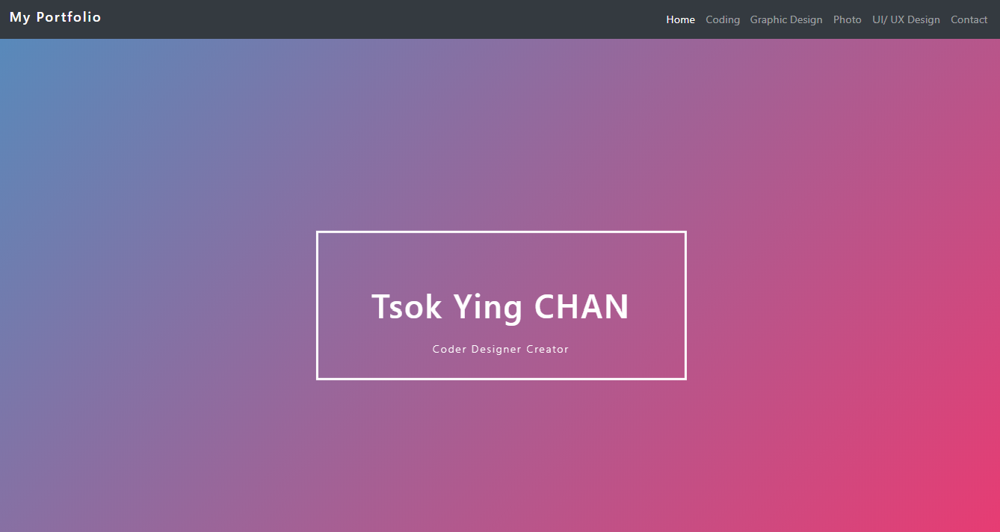
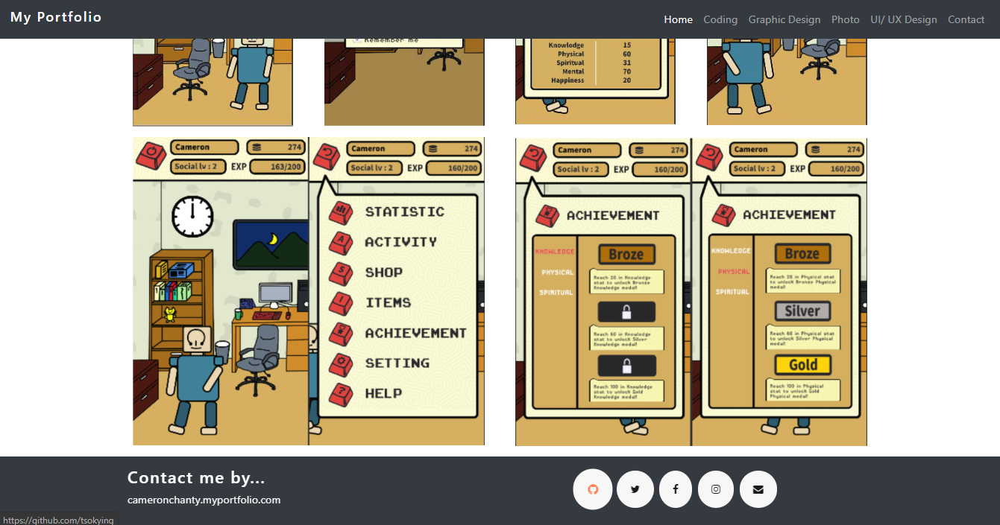
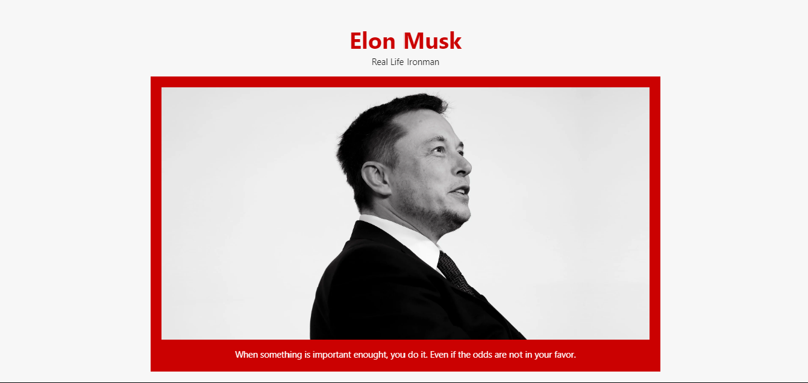
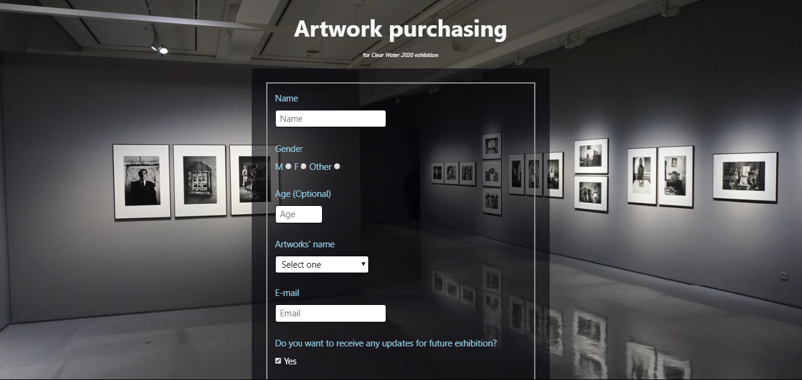
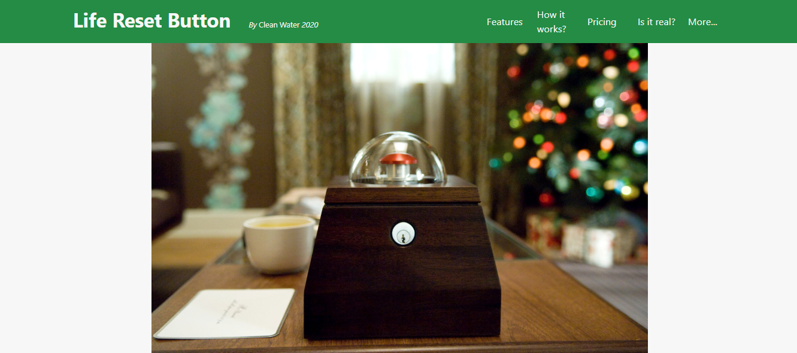
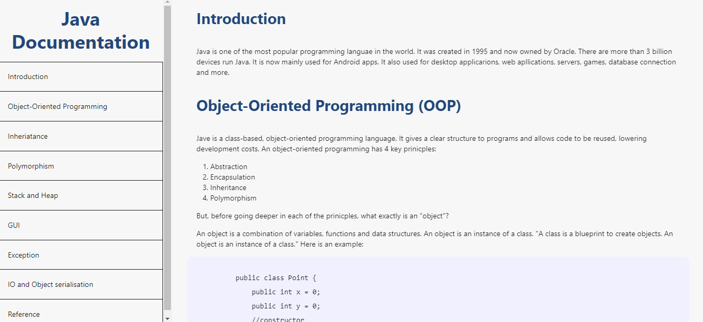
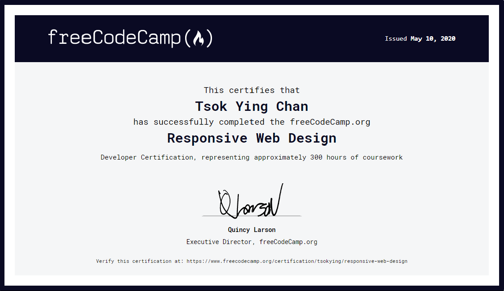

# FreeCodeCamp-Web-Design
Projects for FreeCodeCamp's Responsive Web Design Certification

### 5) Personal Portfolio Webpage
https://tsokying.github.io 

 

### 1) Tribute Page - Elon Musk
https://codepen.io/tsokying/full/VwwBxrp  

### 2) Survey Form - Artworks Purchasing
https://codepen.io/tsokying/full/jOPvGoo  

### 3) Product Landing Page - Life Reset Button
https://codepen.io/tsokying/full/JjYoMwv  

### 4) Technical Documentation - Java
https://codepen.io/tsokying/full/RwWRJqy  

### Certification
https://www.freecodecamp.org/certification/tsokying/responsive-web-design  

